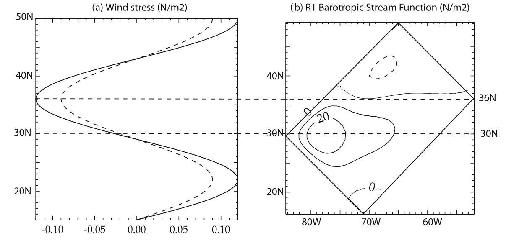

# Mesoscale eddy parameterisations in NEMO5 

This article provides an overview of mesoscale eddy parameterisation available in NEMO version 5. This tutorial is designed for beginners who want to get introduced to eddy parameterisations and learn how to set up NEMO experiments in order to compare available parameterisations. 

* __Prerequisites__: Install [NEMO v5.0.1](https://forge.nemo-ocean.eu/nemo/nemo/-/releases/5.0.1) or later; [XIOS2](https://forge.ipsl.jussieu.fr/ioserver/svn/XIOS2/trunk) and other dependencies (HDF5, NETCDF-C). For the following, you'll need to be able to compile and run a NEMO experiment on your environment (either local or remote).   
* __Objectives__: To introduce mesoscale eddy parameterisations in NEMO, and allow users to test them in a simple test case.
* __Configurations__: GYRE_PISCES

## Overview

In this tutorial, you will :
* set-up and run an idealised gyre configuration (GYRE_PISCES).
* use basic XIOS file manipulation to add extra variables in output files.
* restart different experiments from an initial state, that can be used as a benchmark for eddy parameterisations. 
* modify the configuration namelist in order to set-up mesoscale eddy parameterisations. 
* compare your simulation outputs in order to assess the impact of eddy parameterisation choices on the ocean state.

## Mesoscale parameterisations within the GYRE_PISCES configuration

The GYRE configuration has been built to simulate the seasonal cycle of a double-gyre box model (see Figure below). The configuration is meant to represent an idealized North Atlantic or North Pacific basin.
It consists in an idealized rectangular domain, rotated by 45°, over which an analytical seasonal forcing is applied.
Indeed, the circulation is forced by analytical profiles of wind and buoyancy fluxes. The applied forcings vary seasonally in a sinusoidal manner between winter and summer extrema.

Even though this is a very simple example, it allows to investigate the parameterised transports of mesoscale eddies on tracers and their contribution to the large scale circulation.
In this tutorial, we will use 1° horizontal resolution test case, which is cheap enough to be runned on a personal computer and can be used as a demonstrator for comparing mesoscale parameterisations.

Now that you know a bit more about the configuration you're going to use, it's time to start [the tutorial](https://torresr-cnrm.github.io/GYRE_PISCES-eddy).

&nbsp;

__Figure:__ Left panel: the analytical wind forcings which vary between winter (solid line) and summer (dashed line) in a sinusoidal manner. Right panel: the rotated domain and the mean barotropic stream function as shown in [Lévy et al. (2010)](http://dx.doi.org/10.1016/j.ocemod.2010.04.001)
