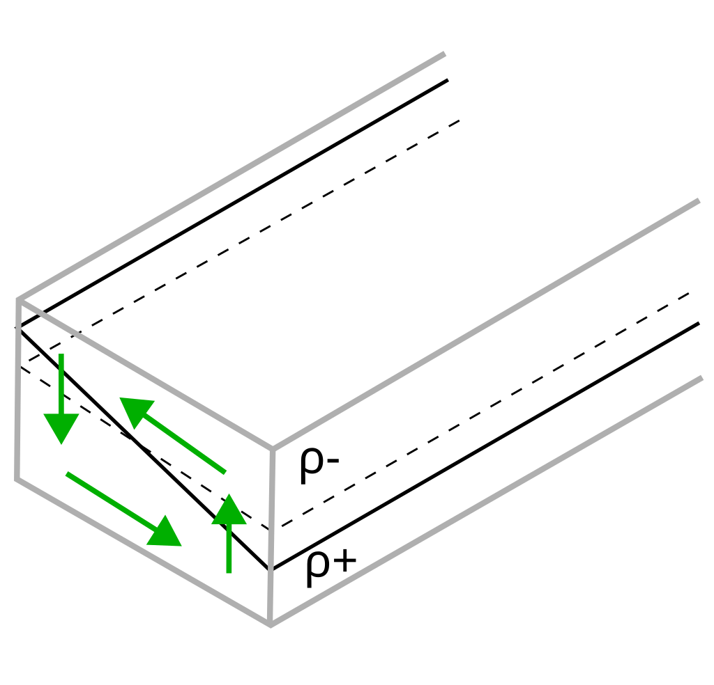

# Mesoscale eddy parameterisations in NEMO5

This page introduces the approach used in NEMO to parameterise the transport of tracers induced be unresolved mesoscale eddies in the ocean. 
In particular, the tutorial focuses on the scheme of [Gent and McWilliams, 1990](https://doi.org/10.1175/1520-0485(1990)020%3C0150:IMIOCM%3E2.0.CO;2), hereafter GM, that represents the eddy buoyancy flux due to baroclinic instability processes.
In this page, we recall the basic formulation of the GM parameterisation, its expected behaviour and the main options available in NEMO5 to constrain the parameterised eddy flux.

> **NOTE:**  Users familiar with the Gent and McWilliams parameterisation and its implementation in NEMO5 can skip this theoretical section and can go to [the spin up set-up](spin_up.md) directly.

## The Gent and McWilliams (1990) parameterisation

The GM scheme is a widely used mesoscale parameterisation in climate and global ocean models where the resolution is insufficient to resolve mesoscale processes. 
It mostly postulates that in an adiabatic process, such as the transport along neutral surfaces in the ocean interior, the divergence of density flux by mesoscale eddies should balance the divergence of the flux due to the large-scale flow. 
The parameterisation of this eddy flux thus results in the introduction of an additional non-conservative term into the density equation. 
One of the key ingredients was the incorporation of this non-conservative term in the transport equation of a tracer while maintaining fundamental properties of an adiabatic flow. 
In particular, the parameterisation preserves the volume of fluid and the domain-average of the tracer between two isopycnals, preventing the diffusion of buoyancy across neutral surfaces. 
The authors successfully derived the non-conservative term and demonstrated that it has the form of an additional advection flux for the tracers (see Figure 1). 

For this reason, it was termed _eddy-induced velocity_, defined by:

$$\mathbf{u}^\star = \begin{bmatrix}
                        u^\star \\
                        v^\star \\
                        w^\star
                      \end{bmatrix} =
                      \begin{bmatrix}
                        - \partial_z \left(\kappa_{gm} S_x\right) \\
                        - \partial_z \left(\kappa_{gm} S_y\right) \\
                        \partial_x\left(\kappa_{gm}S_x\right)+\partial_y\left(    \kappa_{gm}S_y\right)
                      \end{bmatrix}
$$

where $$\kappa_{gm}$$ is called the GM diffusivity or the GM eddy coefficient. In the original publication, the quasi-adiabatic flux is formulated in isopycnal coordinates in which it diffuses the isopycnal heights. Therefore, $$\kappa_{gm}$$ is frequently named _thickness diffusivity_. $$S_x = −\partial_x \rho/\partial_z \rho$$ and $$S_y = −\partial_y \rho/\partial_z \rho$$ are the components of the neutral surface slopes.

  

  
__Figure 1:__ Illustration of the _eddy-induced circulation_ parameterised by the GM scheme which tends to flatten neutral surfaces thus reducing the potential energy in the system.

 

In NEMO5, different approaches for setting the values of $$\kappa_{gm}$$ from the simple constant case to physically-based formulations allowing space and time variations of the eddy coefficient. 
This page focuses on the latter case, in which NEMO offers two different approaches.

### Baroclinic instability-based formulation (Tréguier et al., 1997)

In NEMO, a common choice to employ a time- and space-variable eddy coefficient is to computed the GM coefficient from the large-scale density field. 
Such formulations are derived from linear instability analysis ([Visbeck et al., 1997](https://doi.org/10.1175/1520-0485(1997)027<0381:soetci>2.0.co;2); [Tréguier et al., 1997](https://doi.org/10.1175/1520-0485(1997)027%3C0567:POQEIP%3E2.0.CO;2); [Bryan et al., 1999](https://doi.org/10.1175/1520-0485(1999)029<2442:otmcit>2.0.co;2)) and scale the GM coefficient as the growth rate of an Eady wave times a squared eddy length scale.

In NEMO5, the implementation uses a depth-averaged formulation and is thus closer to the one derived by [Treguier et al. (1997)](https://doi.org/10.1175/1520-0485(1997)027%3C0567:POQEIP%3E2.0.CO;2) and their equation 51:

$$ \kappa_{gm} = R_d^2 \sqrt{\int{M^4/N^2 dz}}$$

where $$M^2$$ and $$N2$$ are the horizontal and vertical buoyancy stratification, respectively, and $R_d$ the local Rossby radius of deformation.

### Energy-constrained mesoscale parameterisation (Mak et al., 2022)

[Marshall et al. (2012)](https://doi.org/10.1175/jpo-d-11-048.1) have proposed a framework to parameterise mesoscale eddy fluxes of potential vorticity. 
This framework offers a geometric interpretation of the parameters in terms of eddy shapes and orientations. 
It is derived from the quasi-geostrophic equations and uses momentum and energy constraints to write the eddy potential vorticity flux in terms of an eddy stress tensor. 
In particular, it allows to redefine the horizontal buoyancy diffusivity associated to $$\kappa_{gm}$$ as a function of the total (kinetic + potential) eddy energy $$E$$. 
In NEMO, the two-dimensional formulation of the GEOMETRIC framework [Mak et al., (2022)](https://doi.org/10.1029/2021GL097259) is used:

$$ \kappa_{gm} = \alpha_{geom} \int{E dz} \int{\frac{N}{M^2} dz}$$

where the parameter $$\alpha_{geom}$$ is a dimensionless constant which represents the eddy efficiency to convert available potential energy into eddy energy. 
By construction, it is bounded by unity.

An important aspect of the GEOMETRIC parameterisation is that the GM coefficient is proportional to an eddy energy field which is computed over the simulation by solving a prognostic eddy energy budget.

## Summary
In this page, we have reviewed the so-called GM parameterisation, one of the most common scheme to represent unresolved mesoscale transport of tracers in low-resolution ocean models. 
In the following, you will set-up a simple experiment to benchmark different options under a simple gyre configuration case.
We will start by [set-up and run a first experiment](setup.md) to spin-up the model for 10 years.
