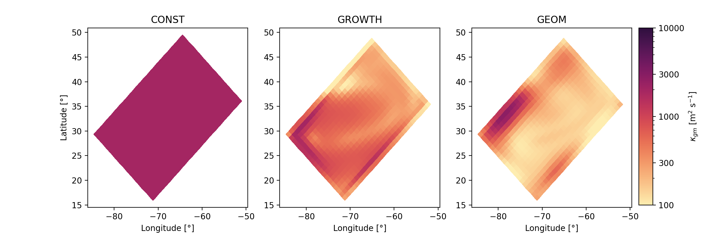

# Analysing results from your gyre experiments

In this page, we show some results to compare our the eddy parameterisations can alter the gyre simulations. 
All the plots showed in this page have been generated using a python jupyter notebook (available in the _scripts_ folder of this repository).
To run it without trouble, you will probably need to install a suite of python libraries. 
We thus provide a **requirements.txt** file in the _scripts_ folder.

## Results overview

__Figure:__ Horizontal distribution of $$\kappa_{gm}$$ in EXPCTRL (left), EXPEIV (middle) and EXPGEOM (right.) 

__Figure:__ Barotropic stream function in EXPCTRL (left), EXPEIV (middle) and EXPGEOM (right.) 

## Summary

