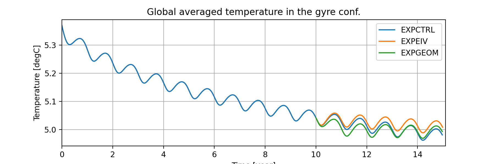
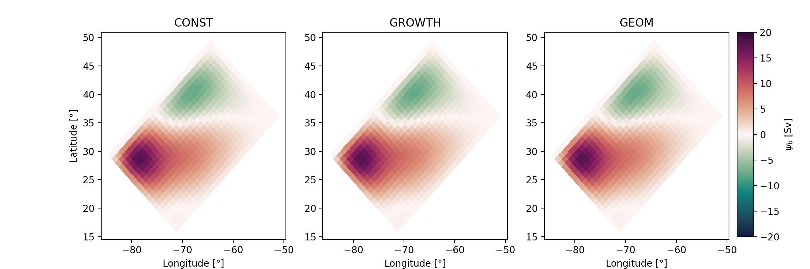
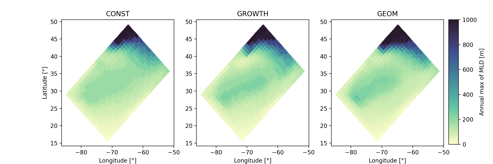
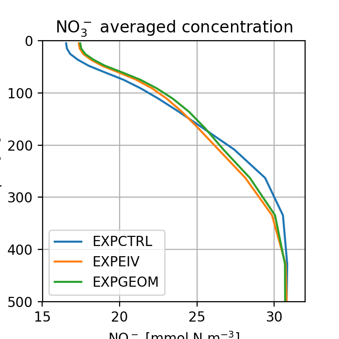
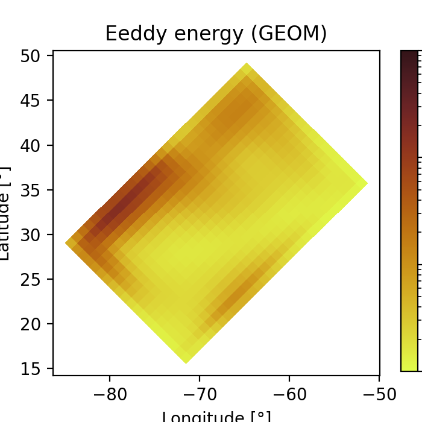

# Analysing results from your gyre experiments

In this page, we show some results to compare our the eddy parameterisations can alter the gyre simulations. 
All the plots showed in this page have been generated using a python jupyter notebook (available in the _scripts_ folder of this repository).
To run it without trouble, you will probably need to install a suite of python libraries. 
We thus provide a **requirements.txt** file in the _scripts_ folder.

## Results overview

__Figure:__ Evolution of the domain-avergaed temperature during our experiments.
 

__Figure:__ Barotropic stream function in EXPCTRL (left), EXPEIV (middle) and EXPGEOM (right). 
 

__Figure:__ Annual maximum of the mixed layer depth (MLD) in EXPCTRL (left), EXPEIV (middle) and EXPGEOM (right). 
 

  

__Figure:__ Averaged profiles of nitrogen (NO$$_3^{-1}$$) in EXPCTRL (blue), EXPEIV (orange) and EXPGEOM (green). 
 

  

__Figure:__ Parameterised eddy energy in EXPGEOM.
 

## Summary

