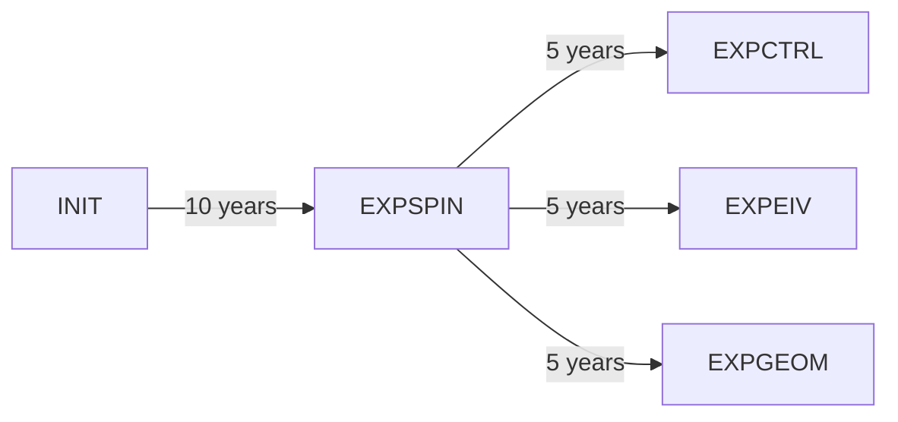

# Eddy parameterisation benchmark with the gyre configuration

This page is a guide to compile and run an idealised gyre configuration. 
Once installed, NEMO5 provides a suite of reference configurations in the _cfgs_ folder.
Two gyre configurations are already installed: GYRE_BFM and GYRE_PISCES. 
In this tutorial, we use GYRE_PISCES which couples the dynamical ocean model of NEMO to PISCES. 
This allows to compute the evolution of bio-eo-chemical matters whitin our ocean domain.

In order to compare different mesoscale coefficients, we need to carefully set-up an experimental protocol.
The idea is to turn-oon the GM tracer advection scheme using a constant $\kappa_{gm}$. 
We will call this experiment _EXPCTRL_ since it serves as control run in order to compare circulation changes with the other runs.
The simulation is first spun-up by running the model with the exact same parameters (_EXPSPIN_). 
The final state of the spin-up will serve at the initial state of the other experiments. 
Finally, we will run two other experiments that define the GM coefficient using the baroclinic instability formulation (_EXPEIV_) or the GEOMETRIC framework (_EXPGEOM_). 

The protocol can be summarised in the diagram bellow. The number of years simulated in this tutorial are indicated, but can be changed and adapted to easily.


<br>

It is now time to set-up your first gyre model. 
But before going further, create a new git branch in order to not incorporate unwanted changes in the main branch:
```bash
git checkout -b tuto-gyre
git status
```
These commands will create and point to a new branch named 'tuto-gyre', and then display the working tree status associated to the current branch.

## Set-up the spin-up experiment (EXPSPIN)

In the top-level NEMO folder, use the *makenemo* script to compile the configuration:
```bash
./makenemo -m 'auto' -n 'GYRE_PISCES' -j 2
```
This command compiles NEMO and stores buildt files in the *cfgs/GYRE_PISCES/BLD* folder. 
In particular, it creates an executable **cfgs/GYRE_PISCES/BLD/bin/nemo.exe** that will be used to run the model.

> **Note**: In this tutorial, we have used an auto arch file generated in order to fit with the NEMO and dependencies installation. You can change it to your needs; numberous of arch diles are available in the _arch_ folder. 

Test your installation by running the model:
```bash
cd cfgs/GYRE_PISCES/EXP00
./nemo &
```
You can follow how the simulation goes by printing the current iteration with `cat time.step`. 
When the iteration reaches _4320_, the simulation is finished. 
Results are stored in _GYRE\_\*\_grid\_\*.nc_ files.

We are now going to create a new experiment to activate the GM parameterisation and spin-up the model for 10 years:
1. Navigate and return to the configuration top-level folder: `cd .. & ls`. At this point, the folder structure should be as follow:
    ```bash
    BLD cpp_GYRE_PISCES_.fcm  EXP00  EXPREF  MY_SRC  WORK
    ```
2. Copy-paste the _EXPREF_ folder which contains links and configuration files with default settings to run the configuration.
    ```bash
    cp -R 'EXPREF' 'EXPSPIN'
    cd EXPSPIN
    ln -s ../BLD/bin/nemo.exe nemo
    ``` 
3. Now open the **namelist_cfg** file and edit the _&namrun_ section in order to have the following settings:
    ```vi
       nn_it000  = 1       !
       nn_itend  = 21600   !
       nn_leapy  = 30      !
       nn_stock  = 10800   !
       nn_write  = 30      !
    ```
4.  Still in the **namelist_cfg** file, add a new section after the _&namtra_ldf_ section, in order to activate the GM parameterisation:
    ```vi
    !-----------------------------------------------------------------------
    &namtra_eiv    !   eddy induced velocity param.                     
    !-----------------------------------------------------------------------
       ln_ldfeiv   = .true.        ! use eddy induced velocity parameterization
    ```
    This activates the default specification of the GM coefficient ($$\kappa_{gm}$$) which is constent all over the ocean domain with a value of $$2 000$$ $$m^2 s^{-1}$$.

The spin-up is now configured. We have kept the default time-step value `rn_Dt = 14400.` in the namelist, wich corresponds to a 4 hours time-stepping between each iteration.
The simulation will then last 10 years (this can be easily changed by setting the final iteration _ǹn_itend_ accordingly).

Before running the model, we will add extra variables using XIOS.

## Adding new variable to the output diagnostics using XIOS

The NEMO strategy to manage input and output files is based on XIOS.
The output files that will be saved during the simulation can be defined for each experiment in its top-level folder within the **file_def_nemo.xml** file.
The _EXPREF_ folder already provides a default xml file that allows to store variables every 5 days as well as additional diagnostic limited to yearly frequency. 

> **Note:** XIOS provides different methods to pre-process the data before storing. By default, variables are time-averaged to the period defined by the 'output_freq' attribute of a 'file_group' entry.

In GYRE_PISCES, many variables of interest are already defined. However, value for $$\kappa_{gm}$$ and the resulting eddy-induced velocity are not. 
Add them in the U- and V-grid requested output files by modifying **file_def_nemo.xml** as follow:
```xml
        <file id="file2" name_suffix="_grid_U" description="ocean U grid variables" >
            <field field_ref="uoce"         name="vozocrtx"  />
            <field field_ref="uoce_eiv"                      />
            <field field_ref="aeiu_2d"                       />
        </file>
        
        <file id="file3" name_suffix="_grid_V" description="ocean V grid variables" >
            <field field_ref="voce"         name="vomecrty"  />
            <field field_ref="voce_eiv"                      />
            <field field_ref="aeiv_2d"                       />
        </file>
```

> **Note:** All requested variables has to be defined in **field_def_nemo-oce.xml** or **field_def_nemo-pisces.xml**. Check within these files first before adding a new request.

## Restart new experiments from the spin-up (EXPCTRL, EXPEIV and EXPGEOM)

At this step, your spin-up experiment is ready to be run. Use the commands `./nemo &` to do it. 
Once finished, use `ls` to list the resulting files. This should return four restart files:
```bash
    GYRE_00010800_restart.nc  GYRE_00010800_restart_trc.nc  GYRE_00021600_restart.nc  GYRE_00021600_restart_trc.nc
```
The number indicates the iteration (in the namelist we have specified to store restart every five years) while the ocean and bio-geo-chemical variables are stored in distinct 'restart' and 'restart_trc' files.

Now we will run three experiments to compare: EXPCTRL, EXPEIV and EXPGEOM.
1. Create a new experiment:
    ```bash
    cd ..
    cp -R EXPRED EXPCTRL & cd EXPCTRL
    ln -s ../BLD/bin/nemo.exe nemo
    rm file_def_nemo.xml
    ln -s ../EXPSPIN/file_def_nemo.xml
    ```
2. Open the **namelis_cfg** file and edit the _&namrun_ section to restart from the last EXPSPIN state:
    ```vi
       nn_it000  = 21601   !
       nn_itend  = 32400   !
       nn_leapy  = 30      !
       nn_stock  = 32400   !
       nn_istate    =      0   !  output the initial state (1) or not (0)
       ln_rstart    = .true.   !  start from rest (F) or from a restart file (T)
       ln_1st_euler = .false.  !  =T force a start with forward time step (ln_rstart=T)
       nn_rstctl    =    2     !  restart control ==> activated only if ln_rstart=T
           !                          !    = 0 nn_date0 read in namelist ; nn_it000 : read in namelist
           !                          !    = 1 nn_date0 read in namelist ; nn_it000 : check consistancy between namelist and restart
           !                          !    = 2 nn_date0 read in restart  ; nn_it000 : check consistancy between namelist and restart
       cn_ocerst_in    = "GYRE_00021600_restart"   !  suffix of ocean restart name (input)
       cn_ocerst_indir = "../EXPSPIN"              !  directory from which to read input ocean restarts
    ```
3. Open the **namelist_top_cfg** file and edit the _&namtrc_run_ section to restart PISCES tracers from the last EXPSPIN state:
    ```vi
       ln_top_euler  = .true.
       ln_rsttr      = .true.    !  start from a restart file (T) or not (F)
       nn_rsttr      =   2       !  restart control = 0 initial time step is not compared to the restart file value
                                 !                  = 1 do not use the value in the restart file
                                 !                  = 2 calendar parameters read in the restart file
       cn_trcrst_in  = "GYRE_00021600_restart_trc"   !  suffix of pass. sn_tracer restart name (input)
       cn_trcrst_indir = "../EXPSPIN"           !  directory from which to read input passive tracer restarts
    ```
4. In the **namelist_cfg** file, add the _&namtra_eiv_ section after the _&namtra_ldf_ one. The formulation is changed by setting the value of the 'nn_aei_ijk_t' parameter.
Here we provide a guide to change it but you can find all the available values in the **namelist_cfg_ref** file. For each experiment, this section should look as follow:
    * EXPCTRL
        ```vi
        !-----------------------------------------------------------------------
        &namtra_eiv    !   eddy induced velocity param.                     
        !-----------------------------------------------------------------------
           ln_ldfeiv   = .true.        ! use eddy induced velocity parameterization
        ```
    * EXPEIV
        ```vi
        !-----------------------------------------------------------------------
        &namtra_eiv    !   eddy induced velocity param.                     
        !-----------------------------------------------------------------------
           ln_ldfeiv   = .true.        ! use eddy induced velocity parameterization
              !
              !                        !  Coefficients:
              nn_aei_ijk_t    = 21          !  space/time variation of eddy coefficient:
        ```
    * EXPGEOM
        ```vi
        !-----------------------------------------------------------------------
        &namtra_eiv    !   eddy induced velocity param.                     
        !-----------------------------------------------------------------------
           ln_ldfeiv   = .true.        ! use eddy induced velocity parameterization
              !
              !                        !  Coefficients:
              nn_aei_ijk_t    = 32          !  space/time variation of eddy coefficient:
        ```
    > **Note:** In EXPGEOM, we used the default settings for the GEOMETRIC parameterisation. However, NEMO5 provides a number of parameters that can be use to custom the eddy energy budget. This can be done by copying the _&namldf_eke_ section of **namelist_ref** in your **namelist_cfg** file and modifying the default values.
    
5. For EXPGEOM only, add eddy energy variables in **file_def_nemo.xml**. Add the following entry in the 'file1' field:
    ```xml
          <!-- GEOMETRIC prognostic equation terms        -->
          <field field_ref="eke"                           />
          <field field_ref="trd_eke_adv_ubt"               />
          <field field_ref="trd_eke_adv_wav"               />
          <field field_ref="trd_eke_lap"                   />
          <field field_ref="trd_eke_peS"                   />
          <field field_ref="trd_eke_keS"                   />
          <field field_ref="trd_eke_dis"                   />
    ```
6. Run the experiments:
    ```bash
    ./nemo &
    ```
    
Now your experiments are done ! 

## Summary

In this page we have shown how to set-up an idealised gyre domain and run it over several years. 
The same configuration is then used to run three experiments that employs different approaches to constrain the GM coefficient.
We can now analyse and [compare our simulation results](results.md).
